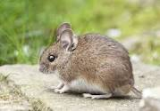

[Titre](titres.md) - [Gras et Italic](grasItalic.md) - [Bloc de citation](citation.md) - [Listes](listes.md) - [Liens](liens.md) - [Images](images.md) - [Bloc de code](code.md) - [Séparation](separation.md) - [Divers](divers.md)

## Les images

```

```

**⇒ Donne**


```

```

**⇒ Donne**


## Un lien sur une image

```
[](https://www.linkedin.com/in/gerardo-cella/)
```

**⇒ Donne**

[](https://www.linkedin.com/in/gerardo-cella/)


## Gif annimé

```

```

**⇒ Donne**


---
[Retour](../description.md#objectif-du-language)